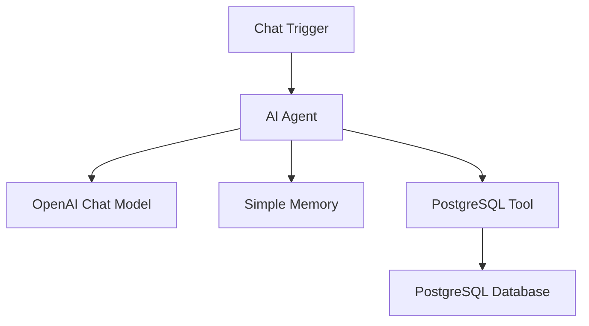

## Workflow — AI Chat with PostgreSQL

### Purpose

Allows users to interact with a PostgreSQL database using natural-language questions instead of writing SQL queries manually.

Example: "Which tables are available?"

### Workflow Architecture

### Components

- Chat Trigger: Receives the user's question through the n8n chat interface.
- AI Agent: Interprets the user's natural-language request and determines the required database operation.
- OpenAI Chat Model: Uses gpt-4o-mini to understand the user's request and assist with generating the required SQL query.
- PostgreSQL Tool: Executes the SQL query dynamically generated by the AI Agent against the PostgreSQL database.
- Simple Memory: Maintains conversational context, allowing the user to ask follow-up questions.

### How It Works

1. The user sends a natural-language question through the n8n chat interface.
2. The Chat Trigger receives the message and passes it to the AI Agent.
3. The AI Agent uses the OpenAI Chat Model to understand the user's intent.
4. If database information is required, the AI Agent uses the PostgreSQL Tool.
5. The required SQL statement is generated dynamically based on the user's question.
6. The PostgreSQL Tool executes the query against the database.
7. The database result is returned to the AI Agent.
8. The AI Agent converts the result into a natural-language response.
9. Simple Memory maintains the conversation context for subsequent questions and follow-ups.

### Key Features

- Natural-language database querying
- AI-assisted SQL generation
- Conversational follow-up questions
- PostgreSQL database integration
- AI Agent-based query execution
- Conversational memory
- Dynamic SQL execution
- Modular n8n workflow architecture
- Can be adapted to other relational databases such as MySQL and SQLite

### Example Queries

Which tables are available?

How many users are in the database?

Show me the top 10 customers.

What is the total revenue?

Show me the records created this month.

How many orders were placed last month?

### Technology Stack

- n8n
- OpenAI — gpt-4o-mini
- PostgreSQL
- LangChain nodes
- Simple Memory / Conversational Memory

### Workflow File

The complete n8n workflow is provided as a JSON file in this repository and can be imported directly into n8n.

Note: PostgreSQL and OpenAI credentials need to be configured in n8n before running the workflow.
